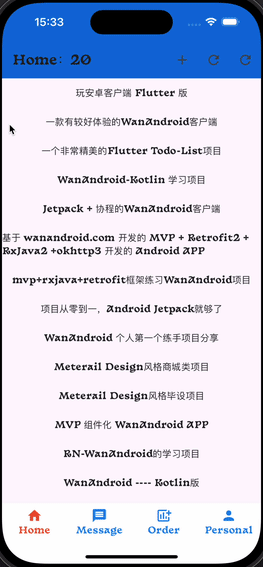
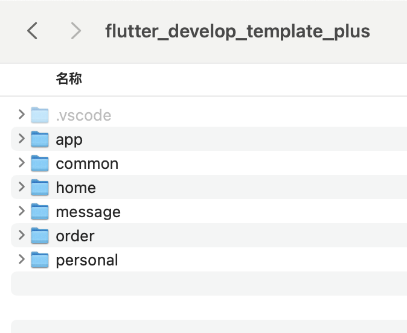

# 前言

当前案例 Flutter SDK版本：**3.22.2**

本文，是由这两篇文章 **结合产出**，所以非常建议大家，先看完这两篇：

**Flutter项目开发模版：**

主要内容：MVVM设计模式及内存泄漏处理，涉及Model、View、ViewModel的实现和使用，以及路由配置与跳转、全局通知、分页处理、Sentry异常上报等；

https://juejin.cn/post/7377949697530871848

**Flutter分模块开发：**

主要内容：创建不同目录，相互依赖，进行**模块开发**，模块可独立启动，利于维护；

https://juejin.cn/post/7377949697530871848

**效果图**

**模块目录**

